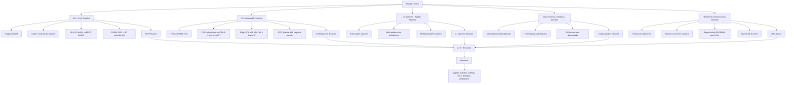

# Shortlisting Graph

This graph shows how the profile should branch into role-specific application narratives.

```mermaid
graph TD
  A["Eishaan Khatri"] --> B["NLP / LLM Shortlist"]
  A --> C["CV / Robust ML Shortlist"]
  A --> D["AI Systems / Agents Shortlist"]
  A --> E["Data Science / Analytics Shortlist"]
  A --> F["Research Assistant / Lab Shortlist"]

  B --> B1["Hinglish ESWA"]
  B --> B2["6,800+ code-mixed dataset"]
  B --> B3["XLM-R, MuRIL, mBERT, BIOES"]
  B --> B4["CASML RAG + KG scientific QA"]

  C --> C1["TTA on CIFAR-10-C"]
  C --> C2["CLIP robustness on CIFAR-C and EuroSAT"]
  C --> C3["Edge-VCA with YOLOv8 + OpenCV"]
  C --> C4["ECE, feature drift, negative transfer"]

  D --> D1["Polka agent systems"]
  D --> D2["Multi-platform bot architecture"]
  D --> D3["RAG/tooling/API systems"]

  E --> E1["Industrial anomaly detection"]
  E --> E2["Forecasting and statistics"]
  E --> E3["XAI finance and dashboards"]

  F --> F1["Research statements"]
  F --> F2["Ablations and error analysis"]
  F --> F3["Reproducible READMEs and CSVs"]
  F --> F4["Advisor/lab fit notes"]

  B --> G["NLP Resume"]
  C --> H["CV/Robust ML Resume"]
  D --> I["AI Systems Resume"]
  E --> J["Data/Analytics Resume"]
  F --> K["RA/Lab CV"]

  G --> L["ATS + Recruiter"]
  H --> L
  I --> L
  J --> L
  K --> L

  L --> M["Interview"]
  M --> N["Explain problem, method, result, limitation, contribution"]
```

